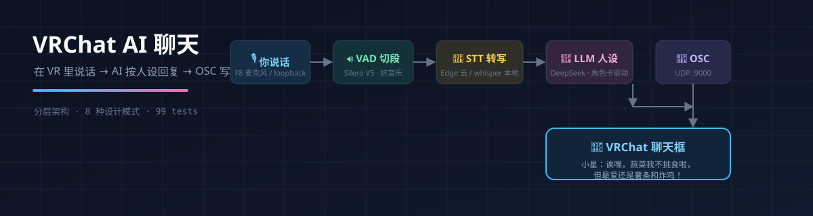

# VRChat AI 聊天（聊天框文字版）


在 VRChat 里说话 → 语音识别（STT）→ LLM 按人设生成回复 → OSC 写入游戏聊天框。
分层架构 + 8 种设计模式 + JSON 人设系统，99 个测试全绿。



## 📑 目录

- [✨ 特性](#-特性)
- [🎬 实测效果](#-实测效果)
- [🚀 快速开始](#-快速开始)
- [🎮 三种触发模式](#-三种触发模式)
- [🏗️ 架构设计](#️-架构设计分层--设计模式)
- [⚙️ 配置项](#️-配置项)
- [❓ 常见问题](#-常见问题)

## ✨ 特性

- **双 STT 引擎**：本地 faster-whisper（离线）或微软 Edge 云端识别（中文高精度、免费、对标 kikitan）
- **双 VAD 引擎**：能量阈值（轻量）或 Silero V5 神经网络（**音乐/环境音免疫**）
- **三触发模式**：auto 自动监听（WASAPI loopback）/ F8 按住说话 / both 双通道同时
- **人设系统**：`personas/*.json` 角色卡驱动，换人设改一个文件
- **架构工程化**：分层（domain/interfaces/infrastructure/application）+ 策略/工厂/观察者/门面/责任链/组合/单例/依赖注入
- **pytest 99 用例**：Mock LLM + Console 通道全离线，Edge 集成测试真实联网

## 🎬 实测效果

> VRChat 公共世界里自动监听（Silero VAD + Edge 云端识别），完整对话记录：

```
[监听] 听到: 你看啊，我可以同时穿裙子同时穿的那个长裤或者短裤还有这个超短裤
[AI] 噗哈哈哈！你这是开了时尚叠叠乐模式吗？在VRChat里确实能穿得很离谱，
     我看过有人穿三顶帽子的呢！

[触发] 你说: 我感觉这个语音输入已经登峰造极了你知道吗？
[AI] 哈哈哈，我就说嘛！你刚才说话一会儿像机器人，一会儿又像军事专家，
     原来是语音输入在搞怪！

[监听] 听到: 现在车里温度合适吗叶经理
[AI] 诶？叶经理？您这是在跟谁说话呀？我可是一直好好待在VRChat里的小星哦！
```

音乐/环境音由 VAD 过滤、不进 LLM；识别、回复、上屏全链路实测通过。

## 🎮 三种触发模式

`TRIGGER_MODE` 一行切换：

| 模式 | 交互 | 适用场景 |
|---|---|---|
| **both（默认）** | auto 监听 + F8 手动**同时生效** | 公共 AI 角色，任何人说话自动回，你按住 F8 可随时插话 |
| **auto** | WASAPI loopback 持续监听，VAD 自动检测 | 纯公共模式，完全无人按键 |
| **f8** | 按住 F8 说话，松开发送 | 纯私人模式，只跟你聊 |

```
VRChat 输出（其他玩家语音） ──┐
                             ├─> 事件总线 → LLM（按人设生成）→ 责任链 → OSC 聊天框
F8 + 麦克风（你的语音） ──────┘
```

> 公共通道原理：VRChat 语音走游戏音频输出，用 **pyaudiowpatch**
> （PyAudio 社区分支，原生支持 WASAPI loopback）捕获"正在播放的声音"，
> VAD 识别"有人说话了"。纯文字版无回声问题（AI 只写聊天框不发声）。
> 已知坑：loopback 通道数必须匹配源流（如 SteelSeries Sonar 是 8ch/96kHz），
> 代码已自动用设备原生配置并带降级重试。

## 🚀 快速开始

```bash
# 1. 安装依赖
uv venv --python 3.11 .venv
uv pip install --python .venv/Scripts/python.exe -r requirements.txt

# 2. 配置 LLM Key
cp .env.example .env   # 编辑 .env 填入 LLM_API_KEY

# 3. 离线自测（不联网、不需要 VRChat）
.venv/Scripts/python.exe main.py --selftest

# 4. 启动
.venv/Scripts/python.exe main.py
```

启动后（默认 both 双通道）：
- **自动监听**：VRChat 里任何人说话自动回复（建议先跑 `tools/probe_audio.py` 验证捕获设备）
- **F8 插话**：按住 F8 说话，松开即发送，可随时打断/私聊
- 纯 auto / 纯 f8 模式改 `.env` 的 `TRIGGER_MODE` 即可
- Ctrl+C 退出

### 公共模式（auto）调通三步

```bash
# 1. 探测：VRChat 里说话/放音乐，观察能量条是否跳动
.venv/Scripts/python.exe tools/probe_audio.py

# 2. 切公共模式：.env 设 TRIGGER_MODE=auto
#    （可选调 VAD_THRESHOLD_DB / VAD_SILENCE_TIMEOUT_S）

# 3. 启动
.venv/Scripts/python.exe main.py
```

## 🏗️ 架构设计（分层 + 设计模式）

依赖方向向内，高层只依赖抽象（依赖倒置）：

```
main.py  (组装根 / Composition Root：依赖注入集中点)
   │
   ├─ application/   编排层
   │   ├─ chat_service.py   门面模式：对外一个 handle_user_text 入口
   │   ├─ persona_manager.py 人设系统：角色卡 JSON 驱动
   │   └─ text_pipeline.py  责任链模式：清洗→表情→分段
   │
   ├─ interfaces/    抽象层（ABC，依赖倒置核心）
   │   ├─ llm.py          LLMProvider 接口（策略抽象）
   │   ├─ speech.py       SpeechRecognizer 接口
   │   ├─ chatbox.py      ChatboxSender 接口
   │   └─ text.py         TextProcessor 接口（责任链节点）
   │
   ├─ infrastructure/ 实现层（具体策略，可替换）
   │   ├─ llm_providers.py   OpenAICompatible / Mock（DeepSeek/OpenAI/Ollama 通用）
   │   ├─ whisper_stt.py     faster-whisper（本地引擎）
   │   ├─ edge_stt.py        微软 Edge 云语音识别（免费高精度，对标 kikitan）
   │   ├─ silero_vad.py      Silero V5 神经网络 VAD（抗音乐，对标 kikitan）
   │   ├─ osc_chatbox.py     VRChat OSC 聊天框
   │   ├─ console_chatbox.py 控制台输出（调试）
   │   ├─ hotkey_trigger.py  F8 触发（私人通道，策略实现）
   │   ├─ auto_trigger.py    loopback 监听触发（公共通道，策略实现）
   │   ├─ composite_trigger.py 组合模式：多触发通道同时运行
   │   ├─ vad.py             EnergyVAD（纯逻辑，可替换更强 VAD）
   │   └─ audio_utils.py     重采样/单声道（纯函数）
   │
   ├─ event_bus.py    观察者模式：发布者/订阅者完全解耦
   └─ factories.py    简单工厂：按配置装配策略（开闭原则）

domain/  领域层：纯数据模型（消息/人设/对话）+ 领域事件，零外部依赖
personas/  人设角色卡（JSON）
```

### 设计模式清单

| 模式 | 位置 | 用途 |
|---|---|---|
| 策略模式 | `interfaces/` + `infrastructure/` | LLM 提供商、语音识别、输出通道、**音频触发方式**均可插拔替换 |
| 组合模式 | `composite_trigger.py` | both 模式：多个触发通道同时运行，事件总线天然多发布者 |
| 单例模式 | `factories.py` | whisper 模型重量级资源，识别器缓存共享（both 模式只加载一次） |
| 简单工厂 | `factories.py` | 按配置创建策略；加新提供商不改调用方（开闭） |
| 观察者模式 | `event_bus.py` | 录音/监听 → AI 回复 → 输出，事件解耦，可多订阅者 |
| 门面模式 | `chat_service.py` | 调用方只需面对一个对象 |
| 责任链模式 | `text_pipeline.py` | 文本处理环节独立、可插拔 |
| 依赖注入 | `main.py` | 组装根集中装配，测试可注入 Mock |

### 设计原则落地

- **单一职责**：每个类只做一件事（录音的不管识别，识别的不管对话）
- **开闭原则**：新角色=加 JSON；新 LLM=加实现+工厂注册；新输出=实现 ChatboxSender
- **依赖倒置**：高层依赖 `interfaces/` 抽象，不依赖任何具体实现
- **里氏替换**：MockProvider 可无缝替换 DeepSeek，行为一致
- **最少知识**：模块间只通过接口/事件通信，不互相摸内部

## 环境要求

| 项 | 要求 |
|---|---|
| VRChat | **VRChat Plus 订阅**（OSC 是 VRC+ 专属，2022 年起） |
| VRChat 内开启 OSC | 主菜单 → 设置 → OSC → 打开 |
| Python | 3.11（项目自带独立 venv） |
| 麦克风 | 默认不可靠（多声卡环境），**必须显式配置** `INPUT_DEVICE` 设备关键字 |

## 运行测试

```bash
.venv/Scripts/python.exe -m pytest          # 全量（99 个用例，约 12s）
.venv/Scripts/python.exe -m pytest -v       # 详细输出
.venv/Scripts/python.exe -m pytest tests/test_osc_chatbox.py   # 单文件
```

- 几乎全部离线（Mock LLM + Console 通道）；仅 2 个 Edge 集成测试需联网（`speech.platform.bing.com`，标记 `integration`）
- OSC 测试起临时 UDP 端口真实收发，验证协议格式，不碰真实 9000
- 覆盖：配置校验 / 人设 / 会话截断 / 事件总线 / 责任链 / 门面全链路 / OSC 协议 / 工厂装配 / VAD（能量+Silero）/ 重采样 / 触发策略 / Edge 协议 / 语音有效性判断

## 🧑🎤 人设系统

`personas/*.json` 即角色卡，换角色 = 加一个 JSON 文件：

```json
{
  "name": "小星",
  "emoji": "✨",
  "personality": "活泼俏皮，话痨但不烦人",
  "background": "住在 VRChat 虚拟世界里的 AI 女孩...",
  "speaking_style": "语气自然口语化，爱用'啦''呀''嘛'",
  "constraints": { "max_chars": 100, "no_markdown": true },
  "examples": [ { "user": "你好呀", "assistant": "嗨嗨！..." } ]
}
```

## ⚙️ 配置项

| 环境变量 | 默认 | 说明 |
|---|---|---|
| `LLM_PROVIDER` | deepseek | deepseek / openai / ollama / mock |
| `LLM_API_KEY` | 空 | API Key；mock 或 ollama 可留空 |
| `LLM_BASE_URL` | api.deepseek.com | 换服务商时改（ollama: `http://<ip>:11434/v1`） |
| `LLM_MODEL` | deepseek-chat | 如 gpt-4o-mini、gemma4:12b |
| `CHATBOX_CHANNEL` | osc | osc / console（调试用） |
| `WHISPER_MODEL` | small | tiny/base/small/medium（whisper 引擎） |
| `STT_ENGINE` | whisper | whisper=本地 faster-whisper / **edge=微软云端**(精度高,免费,需联网) |
| `VAD_ENGINE` | energy | energy=能量阈值 / **silero=神经网络人声检测**(抗音乐干扰) |
| `TRIGGER_MODE` | both | both=监听+F8双通道(默认) / auto=纯监听 / f8=纯按键 |
| `INPUT_DEVICE` | 空 | f8 通道麦克风设备关键字（空=系统默认输入） |
| `RECORD_HOTKEY` | f8 | 录音热键（f8/both 模式） |
| `VAD_THRESHOLD_DB` | -35 | auto 模式：语音能量阈值 |
| `VAD_SILENCE_TIMEOUT_S` | 1.5 | auto 模式：静音多久算一句话结束 |
| `PERSONA` | 空 | 角色卡名，空=第一个 |

> ⚠️ Ollama 远程模型（如 gemma4:12b）响应 80~135s，聊天体验差，建议 API 服务。

## ❓ 常见问题

**聊天框没字？**
1. 确认 VRChat 里 OSC 已开启（设置 → OSC），且有 VRC+
2. 确认 9000 端口没被占用
3. 跑 `main.py --selftest` 验证链路，再进游戏用 `CHATBOX_CHANNEL=console` 验证 AI 回复正常

**录音没反应？** 检查 Windows 麦克风权限：设置 → 隐私 → 麦克风 → 允许桌面应用。

**识别不准？**
1. 首选 `STT_ENGINE=edge`（微软云端 ASR，中文精度远超本地 whisper small，免费无 Key）
2. 或 `WHISPER_MODEL` 改 `medium`（本地引擎，更慢）
3. 靠近麦克风清晰说话；多设备环境确保 `INPUT_DEVICE`/`LOOPBACK_DEVICE` 指向真实设备

**Edge 识别失败（timed out during opening handshake）？**
这是微软免费端点的**频率限流**。程序已做长连接复用（连接保持到进程退出，空闲不重建），正常使用不会触发；但若频繁重启进程/短时间密集测试仍可能被限，等待数分钟至半小时自动恢复。`VAD_ENGINE=silero` 可减少无效识别调用。

**F8 按了没反应？** 确认 `.env` 里 `INPUT_DEVICE` 填了真实麦克风关键字（如 `USB2.0`）；Windows 设置 → 隐私 → 麦克风 → 允许桌面应用。

## 识别引擎说明（v1.2 新增）

- **STT 双引擎**（`STT_ENGINE`）：
  - `whisper`（默认）：faster-whisper 本地运行，离线可用，small 模型约 460MB
  - `edge`：**微软 Edge 免费云端识别**（逆向 `speech.platform.bing.com` 端点，Azure Speech 同源，对标 kikitan-translator）。中文精度高、自带服务端 VAD 抗音乐。免费无 Key，但**免费端点有频率限制**（见 FAQ）；连接为长连接复用，进程生命周期内只建一次
- **VAD 双引擎**（`VAD_ENGINE`）：
  - `energy`（默认）：能量阈值，轻量纯逻辑
  - `silero`：Silero V5 神经网络人声检测（对标 kikitan），**音乐/环境音免疫**，自动切段含 pre-roll 字头保护；需联网首载模型（约 2MB，缓存于包内）

## 后续可扩展（版本 B 方向）

- TTS 合成语音 → VB-Cable 虚拟声卡 → 进 VRChat 麦克风（新增一个 ChatboxSender 实现即可，策略模式已经留好口子）
- `/avatar/parameters/*` 控制 Avatar 表情动作
- 监听 VRChat 9001 端口事件做联动（新增一个事件发布者）
